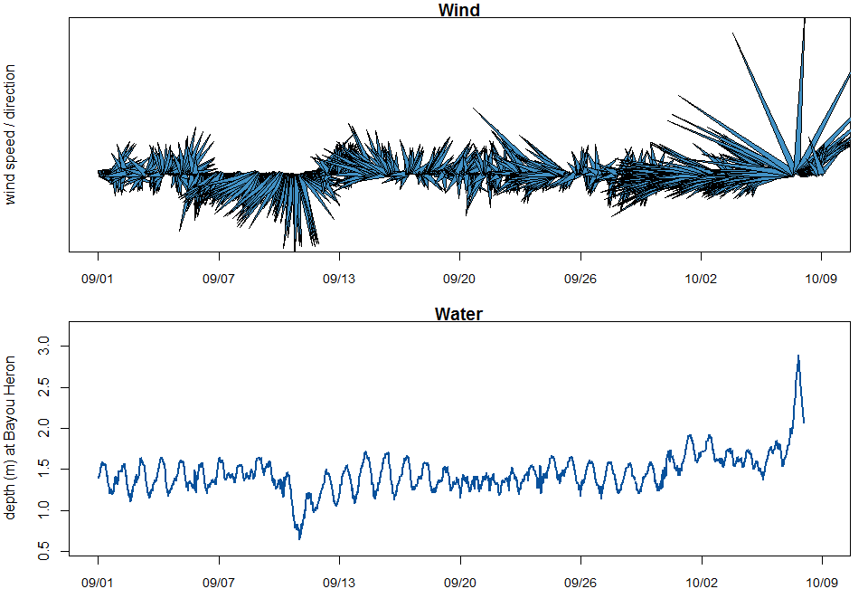
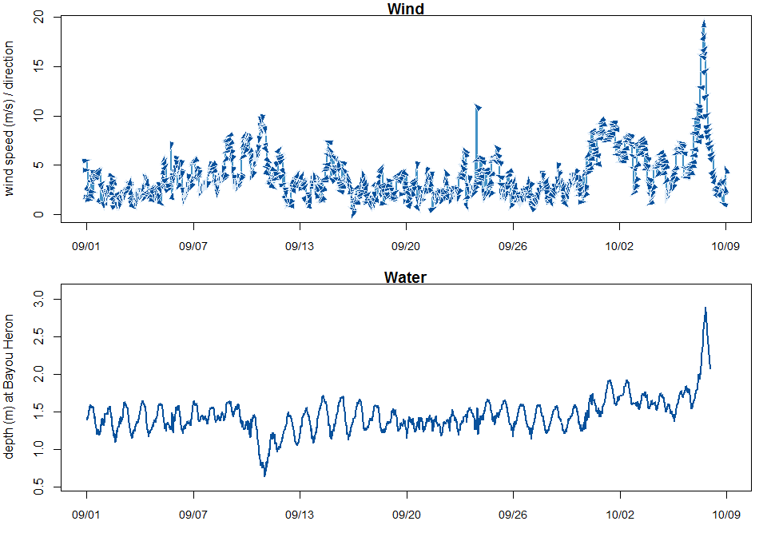
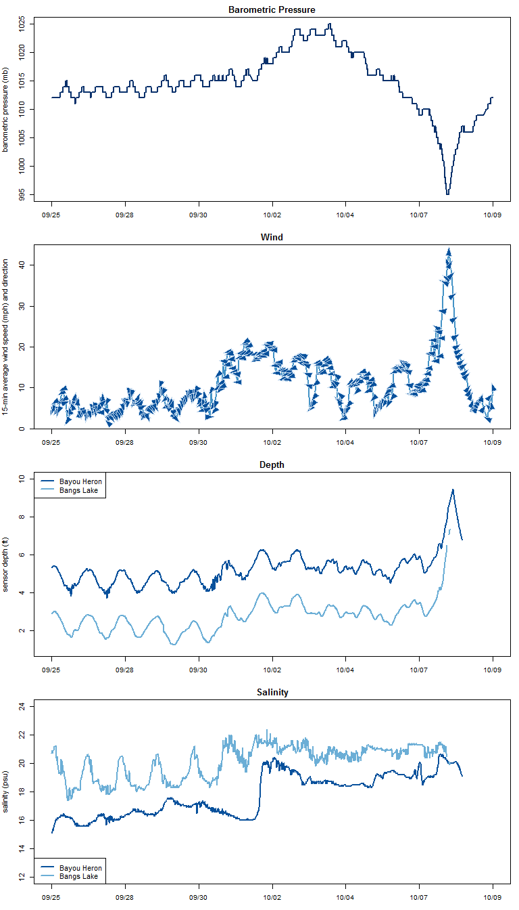
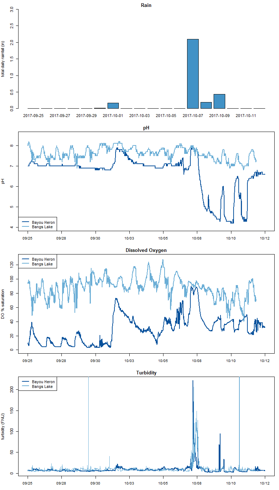

# Visualizations of Hurricane Nate
`r Sys.Date()`  


### Load packages  

Using the following packages in this script: 

+  `dplyr` - for data tidying and manipulation  
+  `lubridate` - for help with dates  
+  `ggplot2` - probably not actually necessary in this script, but I love it  
+  `shape` - to make the arrowheads used in the wind plots  
+  `RColorBrewer` - for color palettes that go together  


```r
# trying to imitate weather underground's wind forecast graphs, where there's a line for wind speed and every hour or two there's an arrowhead pointing in the direction of the wind

library(dplyr)
library(lubridate)
library(ggplot2)
library(shape)
library(RColorBrewer)
```


### Read in data  

Some of this is leftover from earlier scripts, so it could be cleaned up.   

I started by using the CDMO's Data Export System to download data from the weather station (GNDCRMET) and water quality stations (GNDBHWQ, GNDBLWQ, GNDBCWQ), then I manually deleted the extra information at the top and bottom of the csv files (I know, I should be using R for this, but I'm not entirely sure how without hardcoding the number of lines to read in, which will vary based on how much data I download).  

This code reads in both of the csv files into their own data frames; turns all parameter names into lower case for easier coding later; makes sure `datetimestamp` is seen as a date and time (POSIXct, using `lubridate::mdy_mh`); performs some calculations on wind direction to make it play nicely with the `shape` package; and pulls out hourly/every 4-hours/every 6-hours data (using all 15-minute data makes the graphs too busy; which time frame works best depends on how much time you're looking at). I've also called up the "Blues" palette from `RColorBrewer` to use as colors in the plots.  

Some notes on the wind direction data:  

+  wind direction from our weather station is in degrees starting from the top of a circle and moving clockwise. Degrees in the `shape` package starts at the x-axis and moves counter-clockwise.  
+  for our purposes, I ran the numbers; turned the original wind direction into a column called `wdir_or` (for "original"); and used the name `wdir` for the calculated values to go into the graphs.  
+  __the arrows on these graphs point in the direction that wind was moving.__


```r
dat_all <- read.csv("GNDCRMET.csv", stringsAsFactors=FALSE) 
names(dat_all) <- tolower(names(dat_all))
dat_all <- dat_all %>%
    mutate(datetimestamp = as.POSIXct(datetimestamp, format = "%m/%d/%Y %H:%M", tz = "America/Regina"), 
           wdir_or = wdir, 
           wdir = ifelse(wdir_or <= 270, 270 - wdir_or, 630 - wdir_or),
           wspd_mph = wspd * 2.237,
           maxwspd_mph = maxwspd * 2.237,
           totprcp_in = totprcp * 0.03937) 

dat_bh <- read.csv("GNDBHWQ.csv", stringsAsFactors=FALSE) 
names(dat_bh) <- tolower(names(dat_bh))
dat_bh <- dat_bh %>%
    mutate(datetimestamp = as.POSIXct(datetimestamp, format = "%m/%d/%Y %H:%M", tz = "America/Regina"),
           depth_ft = depth * 3.28) 

dat_bl <- read.csv("GNDBLWQ.csv", stringsAsFactors=FALSE) 
names(dat_bl) <- tolower(names(dat_bl))
dat_bl <- dat_bl%>%
    mutate(datetimestamp = as.POSIXct(datetimestamp, format = "%m/%d/%Y %H:%M", tz = "America/Regina"),
           depth_ft = depth * 3.28) 

dat_bc <- read.csv("GNDBCWQ.csv", stringsAsFactors=FALSE) 
names(dat_bc) <- tolower(names(dat_bc))
dat_bc <- dat_bc%>%
    mutate(datetimestamp = as.POSIXct(datetimestamp, format = "%m/%d/%Y %H:%M", tz = "America/Regina"),
           depth_ft = depth * 3.28) 


dat <- dat_all 

# pull out hourly values - this is okay for a few days to a couple weeks
dat_hourly <- filter(dat, grepl(":00:00",datetimestamp))

### OR every 6 hours - for longer time series, like a month or more
dat_6hourly <- filter(dat, grepl("00:00:00|06:00:00|12:00:00|18:00:00",datetimestamp))

### OR every 4 hours - might be better for just a few days
dat_4hourly <- filter(dat, grepl("00:00:00|04:00:00|08:00:00|12:00:00|16:00:00|20:00:00",datetimestamp))

dat_2hourly <- filter(dat, grepl("00:00:00|02:00:00|04:00:00|06:00:00|08:00:00|10:00:00|12:00:00|14:00:00|16:00:00|18:00:00|20:00:00|22:00:00",datetimestamp))

### some palettes to play with from RColorBrewer
rainbowlist <- brewer.pal(9, "Set1")
bluepal <- brewer.pal(9, "Blues")
```


## Graphing wind and water  

We've been having a lot winds out of the east this week, which has been pushing water in to higher-than-normal levels. I've been working on visualizations of wind data anyway, and here's a chance to just do something local and immediate.


### Part 1: in the tradition of feather plots  

__In this graph, lines/triangles point in the direction the wind is moving. The base of each line is at the x-axis. Length of the line represents relative wind speed (longer line = higher wind speed). This is a good way to see changing wind speed and direction!__


This is a great way to see Irma pushing the water out (around 9/11), Nate pushing water in (10/7-10/8), and how wind changes might have affected water levels.


```r
###
# put two graphs on top of each other

par(mfrow = c(2, 1), mar = c(3,4,1,1))

a <- plot(wspd~datetimestamp, data=dat_hourly, 
     type="n", 
     ylim = c(-7, 15),
     yaxt = 'n',
     xaxt = 'n',
     main = 'Wind',
     ylab = 'wind speed / direction',
     xlab = 'date / time')
axis.POSIXct(1, at=seq(min(dat_hourly$datetimestamp, na.rm=TRUE), 
                       max(dat_hourly$datetimestamp, na.rm=TRUE),
                       length.out=7), 
             format="%m/%d", cex.axis=0.9)
a + Arrowhead(x0=dat_hourly$datetimestamp, y0=0, 
          angle=dat_hourly$wdir, 
          arr.type="triangle", 
          arr.length=dat_hourly$wspd/5, 
          arr.adj=0, 
          arr.width=0.15, 
          arr.lwd = 1.5,
          arr.col=bluepal[6])
```

```
## numeric(0)
```

```r
plot(depth ~ datetimestamp, dat = dat_bh,
     type = "l",
     col = bluepal[8],
     lwd = 2,
     xaxt = 'n',
     main = "Water",
     ylim = c(0, 3.2),
     ylab = "sensor depth (m)",
     xlab = "date / time")
lines(depth ~ datetimestamp, dat = dat_bl, 
      col = bluepal[5],
      lwd = 2)
axis.POSIXct(1, at=seq(min(dat_bh$datetimestamp, na.rm=TRUE), 
                       max(dat_bh$datetimestamp, na.rm=TRUE),
                       length.out=8), 
             format="%m/%d", cex.axis=0.9)
legend(x = "topleft", legend = c("Bayou Heron", "Bangs Lake"), col = c(bluepal[8], bluepal[5]), lwd=2)
```

<!-- -->


### Part 2: Imitating the wind forecast graph from weatherunderground.com  


This is similar, but more like the forecast graphs on wunderground - it includes a line for wind speed and arrows to show wind direction. This graph really shows off how the wind was different the week before Nate, with higher-than-normal wind speeds and a different direction.  

I've played around a bit with the line showing higher-frequency wind speed data and the arrows only showing up every few hours, but to me it looks best if the line and arrows are generated from the same time scale. YMMV; play around if you want to. These data frames were generated in the data manipulation code chunk above.


```r
#####
### wunderground wannabe

par(mfrow = c(2, 1), mar = c(3,4,1,1))

# all every 4 hours
b <- plot(wspd~datetimestamp, data=dat_hourly,
     type="l",
     lwd=2,
     xaxt = 'n',
     col=bluepal[6],
     main = 'Wind',
     ylab = 'wind speed (m/s) / direction',
     xlab = 'date / time')
axis.POSIXct(1, at=seq(min(dat_hourly$datetimestamp, na.rm=TRUE), 
                       max(dat_hourly$datetimestamp, na.rm=TRUE),
                       length.out=7), 
             format="%m/%d", cex.axis=0.9)
b + Arrowhead(x0=dat_hourly$datetimestamp,
          y0=dat_hourly$wspd,
          angle=dat_hourly$wdir,
          arr.type="triangle",
          arr.width=0.15,
          arr.length=0.25,
          arr.lwd = 0.1,
          arr.col=bluepal[8],
          lcol = bluepal[2])
```

```
## numeric(0)
```

```r
plot(depth ~ datetimestamp, dat = dat_bh,
     type = "l",
     col = bluepal[8],
     lwd = 2,
     ylim = c(0.55, 3.1),
     xaxt = 'n',
     main = "Water",
     ylab = "depth (m) at Bayou Heron",
     xlab = "date / time")
axis.POSIXct(1, at=seq(min(dat_hourly$datetimestamp, na.rm=TRUE), 
                       max(dat_hourly$datetimestamp, na.rm=TRUE),
                       length.out=8), 
             format="%m/%d", cex.axis=0.9)
```

<!-- -->


***
***
***

### Shareable graphs  

Everything before 9/26 has been cut from the next graphs to focus on data from Nate specifically. Bangs Lake data has been added in for comparison. Bayou Cumbest could be added in, but depth is almost exactly the same as Bangs Lake, and I didn't bother after seeing that.


```r
dat_all <- dat_all %>%
    filter(datetimestamp >= "2017-09-26 00:00")

dat_bh <- dat_bh %>%
    filter(datetimestamp >= "2017-09-26 00:00")

dat_bl <- dat_bl %>%
    filter(datetimestamp >= "2017-09-26 00:00")

dat_storm <- dat_all %>%
    filter(datetimestamp >= "2017-10-07 0:00",
           datetimestamp <= "2017-10-09 0:00")

dat <- dat_all 

# pull out hourly values - this is okay for a few days to a couple weeks
dat_hourly <- filter(dat, grepl(":00:00",datetimestamp))

### OR every 6 hours - for longer time series, like a month or more
dat_6hourly <- filter(dat, grepl("00:00:00|06:00:00|12:00:00|18:00:00",datetimestamp))

### OR every 4 hours - might be better for just a few days
dat_4hourly <- filter(dat, grepl("00:00:00|04:00:00|08:00:00|12:00:00|16:00:00|20:00:00",datetimestamp))

dat_2hourly <- filter(dat, grepl("00:00:00|02:00:00|04:00:00|06:00:00|08:00:00|10:00:00|12:00:00|14:00:00|16:00:00|18:00:00|20:00:00|22:00:00",datetimestamp))
```


We had high winds and high water last week, which is why I've gone back a little over 2 weeks to show somewhat normal conditions.  


Some stats from the storm:  

*  Maximum 15-minute-averaged wind speed was __44.1 mph__  
*  Maximum wind gust was __58.6 mph__  
*  Minimum barometric pressure was __995 mb (29.38 in)__
*  Maximum depth at the Bayou Heron water quality station (High tides in September 2017 were around 5 ft (4.8-5.6)) was __9.8 ft__  
*  Amount of precipitation received on October 7-8 was __2.3 in__


```r
###########################
###########################

par(mfrow = c(4, 1), mar = c(3,4,2,1))


plot(bp ~ datetimestamp, dat_all,
     type = "l",
     col = bluepal[9],
     lwd = 2,
     xaxt = 'n',
     main = "Barometric Pressure",
     ylab = "barometric pressure (mb)",
     xlab = "date / time")
axis.POSIXct(1, at=seq(min(dat_all$datetimestamp, na.rm=TRUE), 
                       max(dat_all$datetimestamp, na.rm=TRUE),
                       length.out=8), 
             format="%m/%d", cex.axis=0.9)

# a <- plot(wspd~datetimestamp, data=dat_hourly, 
#      type="n", 
#      ylim = c(-5, 15),
#      yaxt = 'n',
#      xaxt = 'n',
#      main = 'Wind 1',
#      ylab = 'hourly wind speed / direction',
#      xlab = 'date / time')
# axis.POSIXct(1, at=seq(min(dat_4hourly$datetimestamp, na.rm=TRUE), 
#                        max(dat_4hourly$datetimestamp, na.rm=TRUE),
#                        length.out=5), 
#              format="%m/%d", cex.axis=0.9)
# a + Arrowhead(x0=dat_hourly$datetimestamp, y0=0, 
#           angle=dat_hourly$wdir, 
#           arr.type="triangle", 
#           arr.length=dat_hourly$wspd/5, 
#           arr.adj=0, 
#           arr.width=0.15, 
#           arr.lwd = 1.5,
#           arr.col=bluepal[6])

b <- plot(wspd_mph~datetimestamp, data=dat_hourly,
     type="l",
     lwd=2,
     col=bluepal[6],
     main = 'Wind',
     ylab = '15-min average wind speed (mph) and direction',
     xaxt = 'n',
     xlab = 'date / time')
axis.POSIXct(1, at=seq(min(dat_hourly$datetimestamp, na.rm=TRUE), 
                       max(dat_hourly$datetimestamp, na.rm=TRUE),
                       length.out=8), 
             format="%m/%d", cex.axis=0.9)
b + Arrowhead(x0=dat_hourly$datetimestamp,
          y0=dat_hourly$wspd_mph,
          angle=dat_hourly$wdir,
          arr.type="triangle",
          arr.width=0.18,
          arr.length=0.28,
          arr.lwd = 0.1,
          arr.col=bluepal[8],
          lcol = bluepal[3])
```

```
## numeric(0)
```

```r
plot(depth_ft ~ datetimestamp, dat = dat_bh,
     type = "l",
     col = bluepal[8],
     lwd = 2,
     ylim = c(1, 10),
     xaxt = 'n',
     main = "Depth",
     ylab = "sensor depth (ft)",
     xlab = "date / time")
lines(depth_ft ~ datetimestamp, dat = dat_bl, 
      col = bluepal[5],
      lwd = 2)
axis.POSIXct(1, at=seq(min(dat_bh$datetimestamp, na.rm=TRUE), 
                       max(dat_bh$datetimestamp, na.rm=TRUE),
                       length.out=8), 
             format="%m/%d", cex.axis=0.9)
legend(x = "topleft", legend = c("Bayou Heron", "Bangs Lake"), col = c(bluepal[8], bluepal[5]), lwd=2)

plot(sal ~ datetimestamp, dat = dat_bh,
     type = "l",
     col = bluepal[8],
     lwd = 2,
     ylim = c(0, 24),
     xaxt = 'n',
     main = "Salinity",
     ylab = "salinity (psu)",
     xlab = "date / time")
lines(sal ~ datetimestamp, dat = dat_bl, 
      col = bluepal[5],
      lwd = 2)
axis.POSIXct(1, at=seq(min(dat_bh$datetimestamp, na.rm=TRUE), 
                       max(dat_bh$datetimestamp, na.rm=TRUE),
                       length.out=8), 
             format="%m/%d", cex.axis=0.9)
legend(x = "bottomleft", legend = c("Bayou Heron", "Bangs Lake"), col = c(bluepal[8], bluepal[5]), lwd=2)
```

<!-- -->

***

Probably ought to look at all the water quality parameters. And precip.  

***


```r
###########################
###########################

# make a daily data frame to contain rainfall
dat_rain <- dat_all %>%
    mutate(caldate = date(datetimestamp)) %>%
    group_by(caldate) %>%
    summarize(rain = sum(totprcp)) %>%
    mutate(rain_in = rain * 0.039)

par(mfrow = c(4, 1), mar = c(3,4,2,1))

barplot(dat_rain$rain_in, col = bluepal[6],
        names.arg = dat_rain$caldate,
        main = "Rain",
        ylab = "total daily rainfall (in)",
        xlab = "date",
        # xaxt = "n",
        ylim = c(0, 3))

plot(ph ~ datetimestamp, dat = dat_bh,
     type = "l",
     col = bluepal[8],
     lwd = 2,
     xaxt = 'n',
     main = "pH",
     ylab = "pH",
     ylim = c(4, 8.5),
     xlab = "date / time")
lines(ph ~ datetimestamp, dat = dat_bl, 
      col = bluepal[5],
      lwd = 2)
axis.POSIXct(1, at=seq(min(dat_bh$datetimestamp, na.rm=TRUE), 
                       max(dat_bh$datetimestamp, na.rm=TRUE),
                       length.out=8), 
             format="%m/%d", cex.axis=0.9)
legend(x = "bottomleft", legend = c("Bayou Heron", "Bangs Lake"), col = c(bluepal[8], bluepal[5]), lwd=2)


plot(do_pct ~ datetimestamp, dat = dat_bh,
     type = "l",
     col = bluepal[8],
     lwd = 2,
     xaxt = 'n',
     main = "Dissolved Oxygen",
     ylab = "DO % saturation",
     ylim = c(0, 130),
     xlab = "date / time")
lines(do_pct ~ datetimestamp, dat = dat_bl, 
      col = bluepal[5], 
      lwd = 2)
axis.POSIXct(1, at=seq(min(dat_bh$datetimestamp, na.rm=TRUE), 
                       max(dat_bh$datetimestamp, na.rm=TRUE),
                       length.out=8), 
             format="%m/%d", cex.axis=0.9)
legend(x = "topleft", legend = c("Bayou Heron", "Bangs Lake"), col = c(bluepal[8], bluepal[5]), lwd=2)


plot(turb ~ datetimestamp, dat = dat_bh,
     type = "l",
     col = bluepal[8],
     lwd = 2,
     xaxt = 'n',
     main = "Turbidity",
     ylab = "turbidity (FNU)",
     xlab = "date / time")
lines(turb ~ datetimestamp, dat = dat_bl, 
      col = bluepal[5], alpha = 0.5,
      lwd = 1)
axis.POSIXct(1, at=seq(min(dat_bh$datetimestamp, na.rm=TRUE), 
                       max(dat_bh$datetimestamp, na.rm=TRUE),
                       length.out=8), 
             format="%m/%d", cex.axis=0.9)
legend(x = "topleft", legend = c("Bayou Heron", "Bangs Lake"), col = c(bluepal[8], bluepal[5]), lwd=2)
```

<!-- -->

