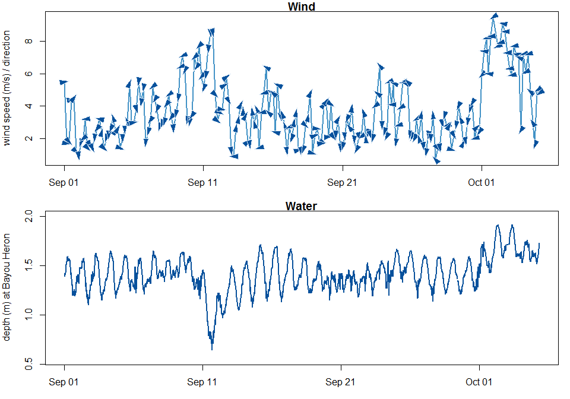
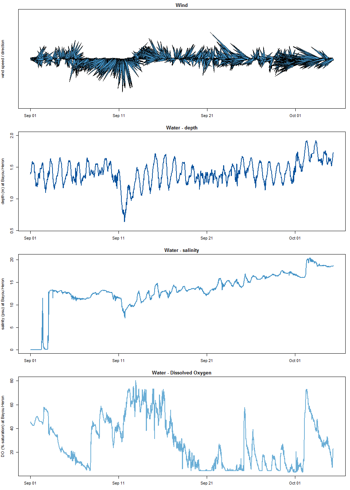

# Visualizations of wind direction
`r Sys.Date()`  


### Load packages  

Using the following packages in this script: 

+  `dplyr` - for data tidying and manipulation  
+  `lubridate` - for help with dates  
+  `ggplot2` - probably not actually necessary in this script, but I love it  
+  `shape` - to make the arrowheads used in the wind plots  
+  `RColorBrewer` - for color palettes that go together  


```r
# trying to imitate weather underground's wind forecast graphs, where there's a line for wind speed and every hour or two there's an arrowhead pointing in the direction of the wind

library(dplyr)
library(lubridate)
library(ggplot2)
library(shape)
library(RColorBrewer)
```


### Read in data  

Some of this is leftover from earlier scripts, so it could be cleaned up.   

I started by using the CDMO's Data Export System to download data from the weather station (GNDCRMET) and a water quality station (GNDBHWQ), then I manually deleted the extra information at the top and bottom of the csv files (I know, I should be using R for this, but I'm not entirely sure how without hardcoding the number of lines to read in, which will vary based on how much data I download).  

This code reads in both of the csv files into their own data frames; turns all parameter names into lower case for easier coding later; makes sure `datetimestamp` is seen as a date and time (POSIXct, using `lubridate::mdy_mh`); and performs some calculations on wind direction to make it play nicely with the `shape` package; and pulls out hourly/every 4-hours/every 6-hours data (using all 15-minute data makes the graphs too busy; which time frame works best depends on how much time you're looking at). I've also called up the "Blues" palette from `RColorBrewer` to use as colors in the plots.  

Some notes on the wind direction data:  

+  wind direction from our weather station is in degrees starting from the top of a circle and moving clockwise. Degrees in the `shape` package starts at the x-axis and moves counter-clockwise.  
+  for our purposes, I ran the numbers; turned the original wind direction into a column called `wdir_or` (for "original"); and used the name `wdir` for the calculated values to go into the graphs.  
+  __the arrows point in the direction that wind was moving.__


```r
dat_all <- read.csv("GNDCRMET.csv", stringsAsFactors=FALSE) 
names(dat_all) <- tolower(names(dat_all))
dat_all <- mutate(dat_all, datetimestamp = mdy_hm(datetimestamp), wdir_or = wdir, wdir = ifelse(wdir_or <= 270, 270 - wdir_or, 630 - wdir_or))

dat_bh <- read.csv("GNDBHWQ.csv", stringsAsFactors=FALSE) 
names(dat_bh) <- tolower(names(dat_bh))
dat_bh <- mutate(dat_bh, datetimestamp = mdy_hm(datetimestamp))

# trim it to only look at a specific time interval
dat <- dat_all 

# pull out hourly values - this is okay for a few days to a couple weeks
dat_hourly <- filter(dat, grepl(":00:00",datetimestamp))

### OR every 6 hours - for longer time series, like a month or more
dat_6hourly <- filter(dat, grepl("00:00:00|06:00:00|12:00:00|18:00:00",datetimestamp))

### OR every 4 hours - might be better for just a few days
dat_4hourly <- filter(dat, grepl("00:00:00|04:00:00|08:00:00|12:00:00|16:00:00|20:00:00",datetimestamp))

### some palettes to play with from RColorBrewer
rainbowlist <- brewer.pal(9, "Set1")
bluepal <- brewer.pal(9, "Blues")
```


## Graphing wind and water  

We've been having a lot winds out of the east this week, which has been pushing water in to higher-than-normal levels. I've been working on visualizations of wind data anyway, and here's a chance to just do something local and immediate.


### Part 1: in the tradition of feather plots  

In this graph, lines/triangles point in the direction the wind is moving. The base of each line is at the x-axis. Length of the line represents relative wind speed (longer line = higher wind speed). This is a good way to see changing wind speed and direction!

I never did find a good way to make feather plots in R - I was able to make some, but it took a lot of fidgeting and manipulation, and they just didn't look good to me. I figured out a way to do something similar using the `shape` package.  

I wanted to stack a wind graph on top of a graph of water depth. Because `shape` only interacts with base graphics, I had to use that and stack them manually with `par(mfrow)` etc.


```r
###
# put two graphs on top of each other

par(mfrow = c(2, 1), mar = c(3,4,1,1))

a <- plot(wspd~datetimestamp, data=dat_hourly, 
     type="n", 
     ylim = c(-7, 7),
     yaxt = 'n',
     main = 'Wind',
     ylab = 'wind speed / direction',
     xlab = 'date / time')
a + Arrowhead(x0=dat_hourly$datetimestamp, y0=0, 
          angle=dat_hourly$wdir, 
          arr.type="triangle", 
          arr.length=dat_hourly$wspd/5, 
          arr.adj=0, 
          arr.width=0.15, 
          arr.lwd = 1.5,
          arr.col=bluepal[6])
```

```
## numeric(0)
```

```r
plot(depth ~ datetimestamp, dat = dat_bh,
     type = "l",
     col = bluepal[8],
     lwd = 2,
     ylim = c(0.55, 2),
     main = "Water",
     ylab = "depth (m) at Bayou Heron",
     xlab = "date / time")
```

<!-- -->


### Part 2: Imitating the wind forecast graph from weatherunderground.com  


Something Shannon suggested (thanks, Shannon!) during my struggles to imitate feather plots was to make something that looks like the forecast graphs on wunderground - with a line for wind speed and arrows to show wind direction.  

I've played around a bit with the line showing higher-frequency wind speed data and the arrows only showing up every few hours, but to me it looks best if the line and arrows are generated from the same time scale. YMMV; play around if you want to. These data frames were generated in the data manipulation code chunk above.


```r
#####
# the attempt at the wunderground graph looked something like this:
# (not quite working, but that's okay for now)
# making a line graph for hourly wind speed, and wind direction overlaid every 6 hours

### wunderground wannabe

par(mfrow = c(2, 1), mar = c(3,4,1,1))

# all every 4 hours
b <- plot(wspd~datetimestamp, data=dat_4hourly,
     type="l",
     lwd=2,
     col=bluepal[6],
     main = 'Wind',
     ylab = 'wind speed (m/s) / direction',
     xlab = 'date / time')
b + Arrowhead(x0=dat_4hourly$datetimestamp,
          y0=dat_4hourly$wspd,
          angle=dat_4hourly$wdir,
          arr.type="triangle",
          arr.width=0.2,
          arr.length=0.35,
          arr.lwd = 0.2,
          arr.col=bluepal[8],
          lcol = bluepal[2])
```

```
## numeric(0)
```

```r
plot(depth ~ datetimestamp, dat = dat_bh,
     type = "l",
     col = bluepal[8],
     lwd = 2,
     ylim = c(0.55, 2),
     main = "Water",
     ylab = "depth (m) at Bayou Heron",
     xlab = "date / time")
```

<!-- -->


### Part 3: Adding other parameters that might be cool


```r
par(mfrow = c(4, 1), mar = c(3,4,2,1))

a <- plot(wspd~datetimestamp, data=dat_hourly, 
     type="n", 
     ylim = c(-7, 7),
     yaxt = 'n',
     main = 'Wind',
     ylab = 'wind speed / direction',
     xlab = 'date / time')
a + Arrowhead(x0=dat_hourly$datetimestamp, y0=0, 
          angle=dat_hourly$wdir, 
          arr.type="triangle", 
          arr.length=dat_hourly$wspd/5, 
          arr.adj=0, 
          arr.width=0.15, 
          arr.lwd = 1.5,
          arr.col=bluepal[6])
```

```
## numeric(0)
```

```r
plot(depth ~ datetimestamp, dat = dat_bh,
     type = "l",
     col = bluepal[8],
     lwd = 2,
     ylim = c(0.55, 2),
     main = "Water - depth",
     ylab = "depth (m) at Bayou Heron",
     xlab = "date / time")

plot(sal ~ datetimestamp, dat = dat_bh,
     type = "l",
     col = bluepal[6],
     lwd = 2,
     main = "Water - salinity",
     ylab = "salinity (psu) at Bayou Heron",
     xlab = "date / time")

plot(do_pct ~ datetimestamp, dat = dat_bh,
     type = "l",
     col = bluepal[5],
     lwd = 2,
     main = "Water - Dissolved Oxygen",
     ylab = "DO (% saturation) at Bayou Heron",
     xlab = "date / time")
```

<!-- -->

